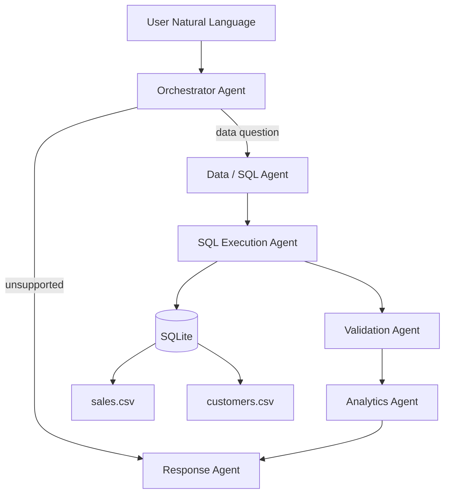

# Architecture

## Agent responsibilities

| Agent | Responsibility |
|---|---|
| Orchestrator | Classifies the request and selects the next path |
| Data/SQL Agent | Converts the question to SQL using an LLM when configured, otherwise deterministic templates |
| SQL Execution Agent | Executes read-only SQL against SQLite |
| Validation Agent | Checks SQL presence, empty results and invalid numeric values |
| Analytics Agent | Converts result sets into business observations |
| Response Agent | Produces the final user-facing response |

## Patterns demonstrated

- Sequential multi-agent workflow
- Conditional routing
- Shared state between agents
- Tool calling against a real database
- Guardrails around generated SQL
- LLM optionality with deterministic fallback

## Azure production mapping

- Azure OpenAI → SQL generation and response reasoning
- Azure AI Foundry → agent lifecycle/evaluation
- Azure SQL / Fabric Warehouse → enterprise data layer
- Azure Data Lake Storage → raw files
- Microsoft Purview → governance and lineage
- Azure Monitor / Application Insights → observability
- Managed Identity + Key Vault → secrets and authentication
